# Document control {-}

| Version | Date | Author | Change |
| --- | --- | --- | --- |
| 0.1 | 2026-08-27 | Abdulsalam | C4 context + container, module map, key flows, decisions D1–D9 (roadmap step 0.5) |

**Status:** Draft · **Related:** Vision (`vision`), SRS (`srs`), Database (`database`).
Diagrams are authored in Mermaid (source kept beside each figure) and rendered to
`assets/*.png` with `mermaid-cli`. Anything not yet built is marked *Planned*.

# Introduction

This document describes the target architecture of Wathiq v1 using the C4 model (context,
container, component) and records the decisions that shape it. The system is a **modular
monolith**: one deployable ABP/.NET application whose modules are isolated in code and in the
database, plus self-hosted AI on the same server.

Architectural drivers (from the SRS): privacy constraint **C1** (personal data never reaches a
cloud AI), cost ceiling **C2** (≤ USD 20/month), solo operation (**NFR-OPS-001**), and
bilingual RTL UI (**NFR-I18N-001**).

# C4 Level 1 — System context

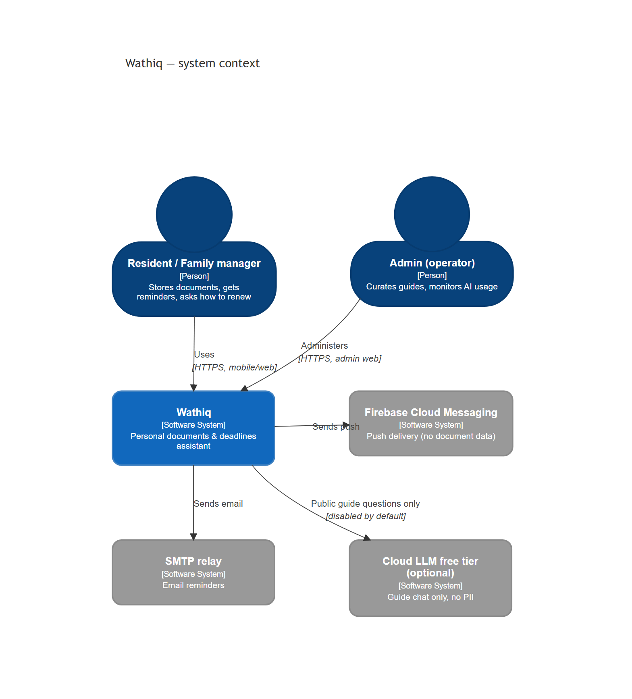

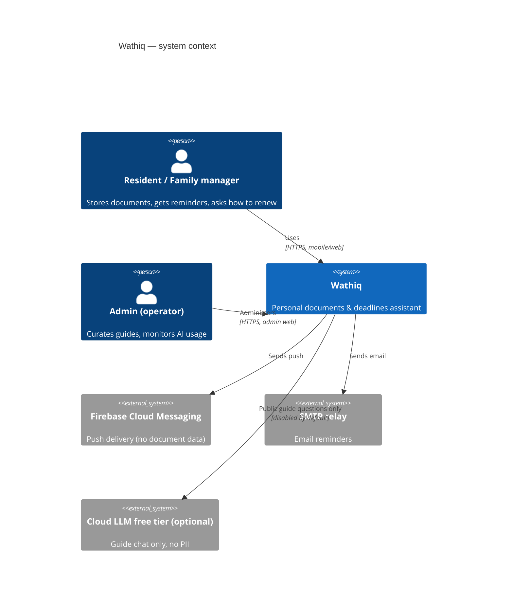

| Element | Responsibility | Trust boundary |
| --- | --- | --- |
| Resident / Family manager | Owns personal data; confirms every AI extraction | External person |
| Admin | Single operator | External person, elevated role |
| Wathiq | Everything that touches personal data | Our server |
| FCM, SMTP | Delivery channels; payloads carry titles, never document fields | Third party |
| Cloud LLM (optional) | Answers public procedure questions when enabled | Third party; PII forbidden (C1) |

# C4 Level 2 — Containers

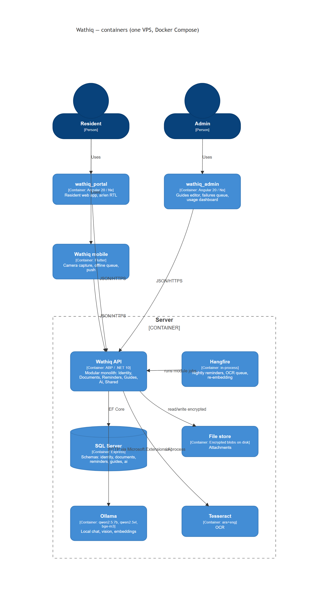

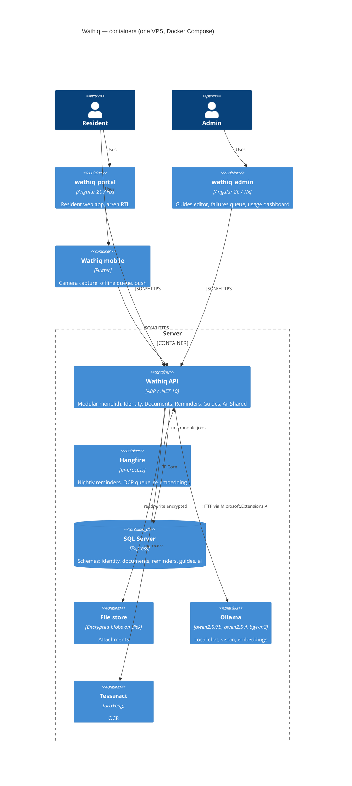

| Container | Technology | Notes | Status |
| --- | --- | --- | --- |
| Wathiq API | ABP, .NET 10, EF Core, OpenIddict | One process hosts all modules and Hangfire | Planned (P1) |
| SQL Server | Express (prod) / LocalDB (dev) | One database, one schema per module | Planned (P1) |
| File store | Local disk, AES-encrypted blobs | Key outside the data volume (NFR-SEC-001); S3-compatible later | Planned (P1, encryption P8) |
| Ollama | qwen2.5:7b, qwen2.5vl:7b, bge-m3 | Only container allowed to see document data | Planned (P3) |
| Tesseract | ara+eng | Deterministic OCR before the LLM (D5) | Planned (P3) |
| wathiq_portal / wathiq_admin | Angular 20, Nx, Tailwind 4 | Two apps, shared Nx libs | Planned (P4, P7) |
| Wathiq mobile | Flutter, Riverpod, Drift | Offline-first | Planned (P6) |

# C4 Level 3 — Modules (components of the API)

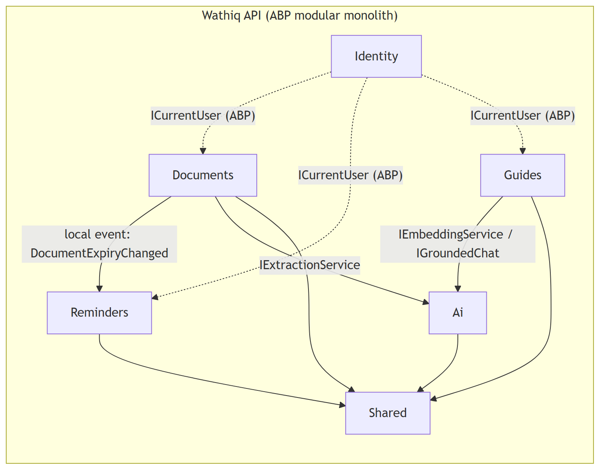

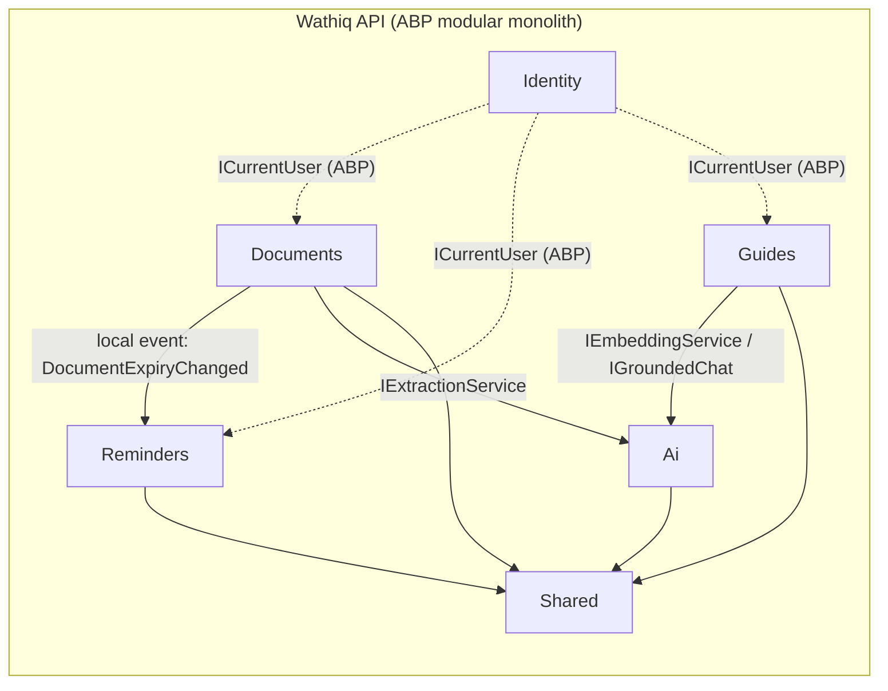

Each module is four projects — `Domain`, `Application`, `EntityFrameworkCore`, `HttpApi` — under
`backend/modules/<Name>/`, the same layering as the reference ABP backend.

| Module | Owns | Exposes to other modules | Depends on |
| --- | --- | --- | --- |
| Identity | Users, roles, family links (ABP Identity) | `ICurrentUser`, user id | — |
| Documents | DocumentType, Holder, Document, Attachment, ExtractionResult | `IDocumentLookup` (id → expiry, holder); event `DocumentExpiryChanged` | Ai, Shared |
| Reminders | ReminderRule, Reminder, DeliveryLog; nightly job | — | Documents (events + lookup), Shared |
| Guides | Guide, GuideVersion, GuideStep, GuideChunk (+embedding), Feedback | `IGuideSearch` | Ai, Shared |
| Ai | Provider routing, prompts, Usage, caps, eval samples | `IExtractionService`, `IEmbeddingService`, `IGroundedChat` | Shared |
| Shared | File storage abstraction, localization, audit, encryption | `IFileStore`, `IEncryptor` | — |

**Module rules**

1. **No cross-module DB joins.** Each module has its own `DbContext` and SQL schema; a module
   never maps another module's tables. Where the reference backend uses one shared
   `MoDBenefitTrackDbContext` with all `DbSet`s, Wathiq deliberately splits it (see D10).
2. Cross-module reads go through an application-service interface in the owning module
   (`IDocumentLookup`), returning DTOs — never entities.
3. Cross-module reactions go through ABP local events (`DocumentExpiryChanged` → Reminders).
4. Foreign keys across schemas are stored as plain `Guid` columns without a database constraint;
   integrity is enforced in the owning module's application service.
5. Only `Ai` references `Microsoft.Extensions.AI`; no provider SDK type appears outside it.

# Key flows

## Add a document with extraction (UC-01)

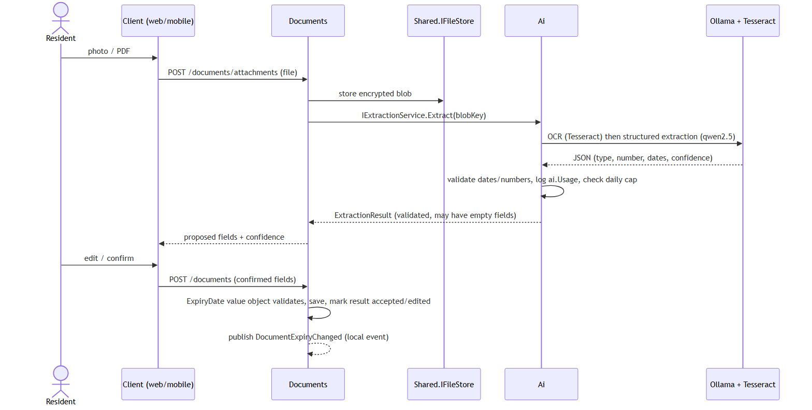

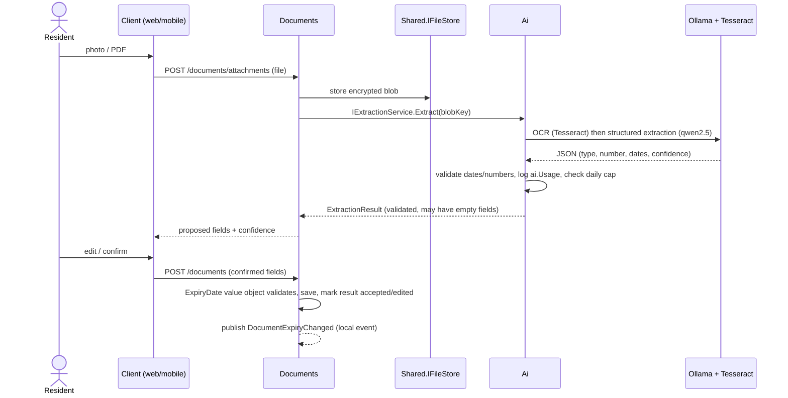

## Nightly reminder run (UC-02)

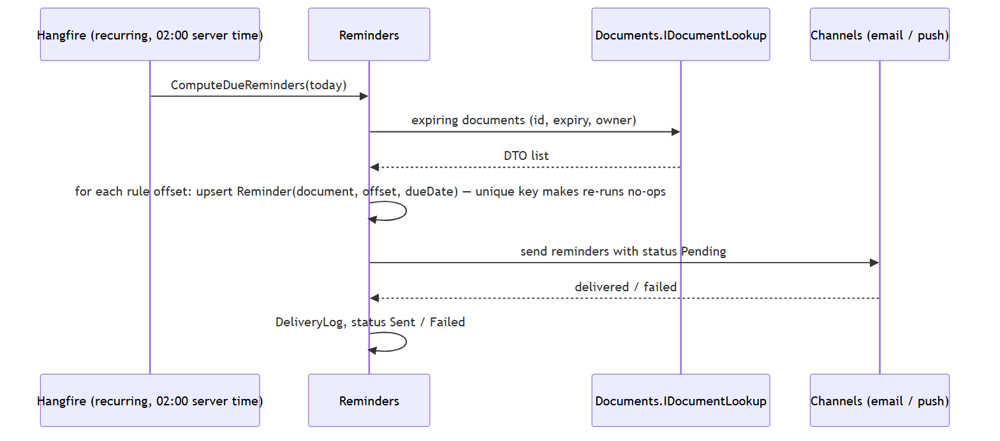

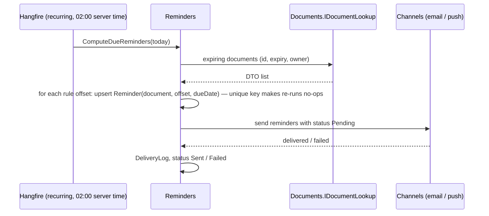

Idempotency: `Reminder` has a unique index on `(DocumentId, OffsetDays)`; sending is gated by
status, so a second run on the same day finds nothing Pending (FR-REM-002).

## Grounded renewal answer (UC-03)

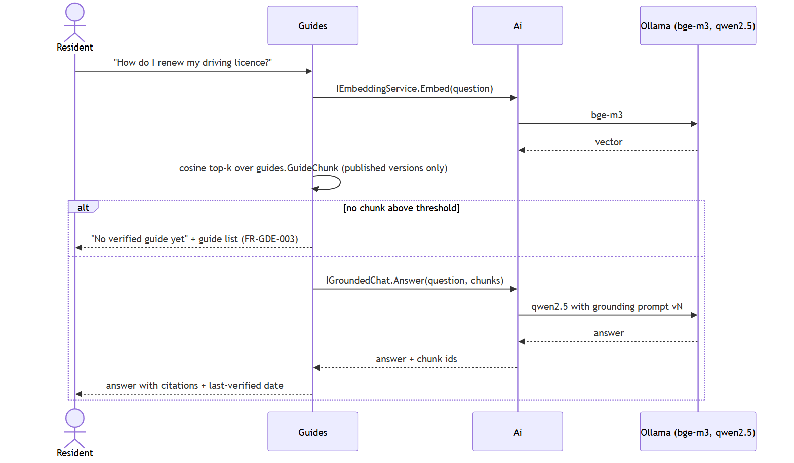

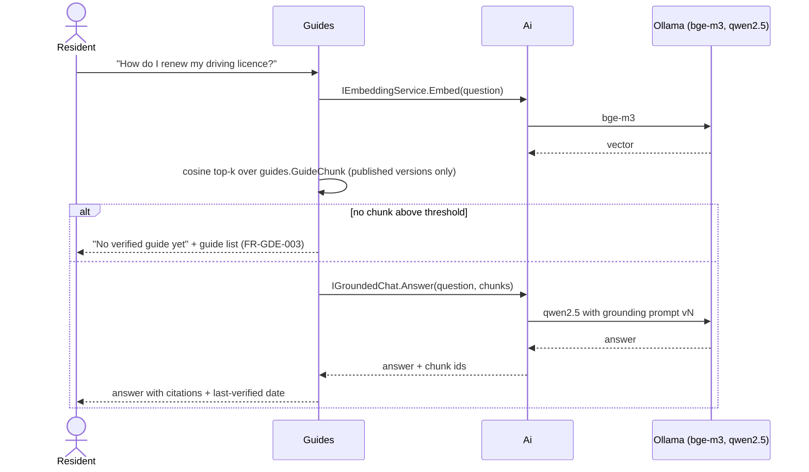

# Cross-cutting concerns

| Concern | Approach | Status |
| --- | --- | --- |
| Authentication | OpenIddict (ABP), OIDC code flow for web, password/refresh for mobile | Planned (P1) |
| Authorization | ABP permissions per module; data filtered by owner user id | Planned (P1) |
| Privacy routing | `Ai` chooses provider per *purpose*: `Extraction` → local only; `GuideChat` → local or cloud by config | Planned (P3) |
| Usage caps | `ai.Usage` row per call; per-user daily count checked before each call | Planned (P3) |
| Localization | ABP localization JSON (ar, en); clients carry their own `ar.json`/`en.json` | Planned (P1, P4) |
| Files | `IFileStore` abstraction; local encrypted disk now, S3-compatible later | Planned (P1) |
| Observability | Serilog → Seq; health checks; Hangfire dashboard (admin only) | Planned (P7) |
| Deployment | Docker Compose: api, sql, ollama; volumes for data/files/models | Planned (P0.6 skeleton, P7) |

# Decisions log

D1–D9 are from `docs/PLAN.md` §6 and are summarised here; D10 onward are recorded as ADRs in
`docs/decisions/`.

| ID | Decision | Consequence |
| --- | --- | --- |
| D1 | ABP modular monolith | One deployable; module discipline enforced by convention and separate DbContexts |
| D2 | SQL Server incl. embeddings | Vectors as `VARBINARY`, cosine computed in code until the `VECTOR` type is available |
| D3 | `Microsoft.Extensions.AI` first | Provider is configuration; SK optional later |
| D4 | Ollama + Qwen 2.5 | Fully private; quality risk R1 mitigated by evals |
| D5 | Tesseract before vision LLM | Cheap deterministic OCR; LLM structures text |
| D6 | Angular 20 signals, standalone | Modern Angular; contrast with reference repo |
| D7 | Flutter + Riverpod + go_router + Drift | Offline-first mobile |
| D8 | Markdown → Pandoc `.docx` | Regenerable documents (this pipeline) |
| D9 | Local git until Phase 9 | Publish after privacy features exist |
| D10 | One `DbContext` and one SQL schema per module (ADR-001) | Differs from the reference backend's single shared context; migrations per module |

# Open points {-}

- Embedding storage: `VARBINARY` + in-code cosine vs SQL Server 2025 `VECTOR` — revisit in Phase 5.
- Push provider for iOS without a paid Apple developer account — decide in Phase 6.
