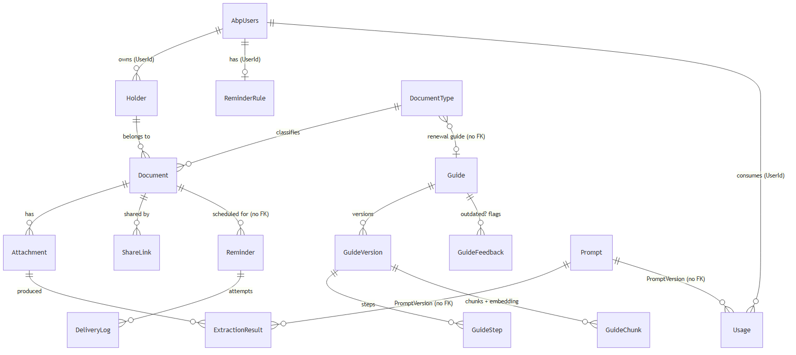
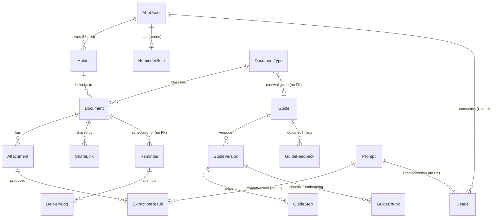

# Document control {-}

| Version | Date | Author | Change |
| --- | --- | --- | --- |
| 0.1 | 2026-08-27 | Abdulsalam | ERD v0.1 (five schemas), data dictionary, index plan, retention notes (roadmap step 0.5) |
| 0.1.1 | 2026-08-27 | Abdulsalam | Migrations log: host initial migration (1.1), `documents` schema initial migration (1.3) |
| 0.1.2 | 2026-08-27 | Abdulsalam | Migrations log row 3: `DocumentType` + `Holder` tables and indexes (1.4); those two tables are now *Implemented* |
| 0.1.3 | 2026-08-27 | Abdulsalam | Migrations log row 4: `Document` + `Attachment` (1.5); `IssueDate`/`ExpiryDate` documented as the owned value object `ValidityPeriod` |
| 0.1.4 | 2026-08-27 | Abdulsalam | Migrations log row 5: `reminders` schema initial (empty) migration — Reminders module skeleton (2.1) |
| 0.1.5 | 2026-08-27 | Abdulsalam | Migrations log row 6: `ReminderRule` table (2.2); `ReminderRule` marked *Implemented*, `OffsetsDays` documented as the `ReminderOffsets` value object |
| 0.1.6 | 2026-08-28 | Abdulsalam | Migrations log row 7: `Reminder` + `DeliveryLog` tables (2.3); both marked *Implemented* |
| 0.1.7 | 2026-08-28 | Abdulsalam | Migrations log row 8: `ai` schema + `Usage` table (3.2); `Usage` marked *Implemented* |
| 0.1.8 | 2026-08-29 | Abdulsalam | Migrations log row 9: `ExtractionResult` table (3.6), marked *Implemented*; `PromptVersion` widened 16→32 (real ids like `extract-document@v1` are 19 chars) |
| 0.1.9 | 2026-08-29 | Abdulsalam | Migrations log row 10: `ai.Usage.PromptVersion` widened 16→32 too — the 3.8 end-to-end cap test caught the ledger still on 16 |

**Status:** Draft · **Related:** Architecture (`architecture`) D2/D10, SRS (`srs`).
Tables in this version are *Planned* until their migration appears in the migrations log, which
is appended in the same commit as each migration.

# Principles

| ID | Rule | Rationale |
| --- | --- | --- |
| DB1 | One database, **one schema per module**: `identity`, `documents`, `reminders`, `guides`, `ai` | Module boundary is visible in SQL; a module's `DbContext` maps only its schema (Architecture D10) |
| DB2 | No foreign-key constraints across schemas; cross-module references are plain `uniqueidentifier` columns | Keeps modules independently migratable; integrity owned by the application service |
| DB3 | Primary keys are `uniqueidentifier` (ABP `Guid` entities, sequential ids) | Client-generated ids, safe merges from the offline mobile queue |
| DB4 | ABP audit columns on every aggregate: `CreationTime`, `CreatorId`, `LastModificationTime`, `LastModifierId`, `IsDeleted`, `DeletionTime` | Soft delete + audit for free via `FullAuditedAggregateRoot` |
| DB5 | Bilingual names stored as two columns `NameAr`, `NameEn` — never JSON blobs | Simple indexing and sorting per language |
| DB6 | Dates that are calendar dates (issue, expiry) are `date`; instants are `datetime2` in UTC | Expiry has no time zone; delivery timestamps do |
| DB7 | Personal free text and files are encrypted at rest; embeddings are derived from public guide text only | SRS NFR-SEC-001, NFR-PRV-001 |

# ERD v0.1

Dashed "no FK" relations cross a schema boundary and are enforced in code (DB2).

# Data dictionary

Types are SQL Server types. Audit columns (DB4) are omitted from each table for brevity.
`PK` primary key, `UQ` unique, `IX` indexed, `→` logical reference.

## Schema `identity`

ABP Identity tables (`AbpUsers`, `AbpRoles`, `AbpUserRoles`, …) and OpenIddict tables as
generated by ABP. No custom columns in v0.1. Family relations live in `documents.Holder`, not in
identity, so that Identity stays a stock module.

## Schema `documents`

### `documents.DocumentType` (E-DocumentType) — *Implemented (1.4)*

| Column | Type | Null | Notes |
| --- | --- | --- | --- |
| Id | uniqueidentifier | no | PK |
| Code | nvarchar(32) | no | UQ; e.g. `NATIONAL_ID`, `PASSPORT`, `DRIVING_LICENCE`, `VEHICLE_REG`, `INSURANCE`, `CONTRACT`, `PERMIT`, `OTHER` |
| NameAr | nvarchar(128) | no | |
| NameEn | nvarchar(128) | no | |
| DefaultValidityMonths | int | yes | Pre-fills expiry from issue date |
| RenewalGuideId | uniqueidentifier | yes | → `guides.Guide` (no FK) |
| SortOrder | int | no | |
| IsActive | bit | no | |

### `documents.Holder` (E-Holder) — *Implemented (1.4)*

| Column | Type | Null | Notes |
| --- | --- | --- | --- |
| Id | uniqueidentifier | no | PK |
| UserId | uniqueidentifier | no | IX; → `identity.AbpUsers` (no FK); the owner |
| FullName | nvarchar(256) | no | Encrypted at rest (P8) |
| Relation | tinyint | no | enum: Self=0, Spouse, Child, Parent, Other |
| BirthDate | date | yes | |
| IsSelf | bit | no | Exactly one per user (filtered UQ on UserId where IsSelf=1) |

### `documents.Document` (E-Document) — *Implemented (1.5)*

| Column | Type | Null | Notes |
| --- | --- | --- | --- |
| Id | uniqueidentifier | no | PK |
| OwnerUserId | uniqueidentifier | no | IX; data filter key |
| HolderId | uniqueidentifier | no | FK → Holder |
| DocumentTypeId | uniqueidentifier | no | FK → DocumentType |
| Number | nvarchar(64) | yes | Encrypted at rest (P8) |
| IssueDate | date | yes | Owned value object `ValidityPeriod` (EF `OwnsOne`) flattens to these two columns |
| ExpiryDate | date | yes | Same value object; `ExpiryDate >= IssueDate` enforced in its constructor (FR-DOC-003); `IX_Document_ExpiryDate` |
| Status | tinyint | no | enum: Active=0, Expired, Renewed, Archived |
| Notes | nvarchar(1024) | yes | Encrypted at rest (P8) |
| PreviousExpiryDate | date | yes | Kept when marked renewed (FR-DOC-006) |
| ConcurrencyStamp | nvarchar(40) | no | ABP optimistic concurrency |

Indexes: `IX_Document_OwnerUserId`, `IX_Document_ExpiryDate` (timeline query, NFR-PRF-001 — a composite
`OwnerUserId, ExpiryDate` index is deferred until the timeline query exists in step 1.6), `IX_Document_HolderId`.

### `documents.Attachment` (E-Attachment) — *Implemented (1.5)*

| Column | Type | Null | Notes |
| --- | --- | --- | --- |
| Id | uniqueidentifier | no | PK |
| DocumentId | uniqueidentifier | no | FK → Document; IX |
| BlobKey | nvarchar(256) | no | Key in `IFileStore`; file bytes never in SQL |
| MimeType | nvarchar(64) | no | image/jpeg, image/png, application/pdf |
| SizeBytes | bigint | no | |
| OcrText | nvarchar(max) | yes | Tesseract output; encrypted at rest (P8) |
| IsEncrypted | bit | no | False until P8 migration |
| Sha256 | binary(32) | no | De-duplication and integrity |

### `documents.ExtractionResult` (E-ExtractionResult) — *Implemented (3.6)*

| Column | Type | Null | Notes |
| --- | --- | --- | --- |
| Id | uniqueidentifier | no | PK |
| AttachmentId | uniqueidentifier | no | FK → Attachment (Cascade: no orphaned extraction PII); IX |
| Provider | nvarchar(32) | no | `ollama` only for extraction (FR-AI-002) |
| Model | nvarchar(64) | no | e.g. `qwen2.5:7b` |
| PromptVersion | nvarchar(32) | no | → `ai.Prompt` (no FK); e.g. `extract-document@v1` |
| RawJson | nvarchar(max) | no | Model output after schema validation |
| Confidence | decimal(4,3) | yes | 0–1 overall |
| Outcome | tinyint | no | enum: Proposed=0, Accepted, Edited, Rejected, Failed |
| DurationMs | int | no | |

### `documents.ShareLink` (E-ShareLink) — *Planned P8*

| Column | Type | Null | Notes |
| --- | --- | --- | --- |
| Id | uniqueidentifier | no | PK |
| DocumentId | uniqueidentifier | no | FK → Document |
| TokenHash | binary(32) | no | UQ; raw token only in the URL |
| ExpiresAt | datetime2 | no | ≤ 7 days from creation (FR-DOC-008) |
| RevokedAt | datetime2 | yes | |
| AccessCount | int | no | |

## Schema `reminders`

### `reminders.ReminderRule` (E-ReminderRule) — *Implemented (2.2)*

| Column | Type | Null | Notes |
| --- | --- | --- | --- |
| Id | uniqueidentifier | no | PK |
| UserId | uniqueidentifier | no | UQ; one rule per user |
| OffsetsDays | nvarchar(64) | no | CSV `90,30,7,1` (value object in domain) |
| Channels | tinyint | no | flags: Email=1, Push=2 |
| QuietFrom | time | yes | Local time of user |
| QuietTo | time | yes | |
| TimeZoneId | nvarchar(64) | no | IANA id, e.g. `Asia/Riyadh` |

### `reminders.Reminder` (E-Reminder) — *Implemented (2.3)*

| Column | Type | Null | Notes |
| --- | --- | --- | --- |
| Id | uniqueidentifier | no | PK |
| UserId | uniqueidentifier | no | IX |
| DocumentId | uniqueidentifier | no | → `documents.Document` (no FK) |
| OffsetDays | int | no | |
| DueDate | date | no | ExpiryDate − OffsetDays |
| Status | tinyint | no | enum: Pending=0, Sent, Failed, Cancelled |
| SentAt | datetime2 | yes | UTC |

Indexes: `UQ_Reminder_DocumentId_OffsetDays` (idempotent upsert, FR-REM-002),
`IX_Reminder_Status_DueDate` (nightly job scan).

### `reminders.DeliveryLog` (E-DeliveryLog) — *Implemented (2.3)*

| Column | Type | Null | Notes |
| --- | --- | --- | --- |
| Id | uniqueidentifier | no | PK |
| ReminderId | uniqueidentifier | no | FK → Reminder; IX |
| Channel | tinyint | no | Email=1, Push=2 |
| AttemptedAt | datetime2 | no | UTC |
| Succeeded | bit | no | |
| Error | nvarchar(512) | yes | |

## Schema `guides`

### `guides.Guide` (E-Guide)

| Column | Type | Null | Notes |
| --- | --- | --- | --- |
| Id | uniqueidentifier | no | PK |
| Slug | nvarchar(64) | no | UQ; e.g. `renew-driving-licence` |
| TitleAr | nvarchar(256) | no | |
| TitleEn | nvarchar(256) | no | |
| PublishedVersionId | uniqueidentifier | yes | → GuideVersion currently served |
| IsActive | bit | no | |

### `guides.GuideVersion` (E-GuideVersion)

| Column | Type | Null | Notes |
| --- | --- | --- | --- |
| Id | uniqueidentifier | no | PK |
| GuideId | uniqueidentifier | no | FK → Guide; IX |
| VersionNo | int | no | UQ with GuideId |
| Language | char(2) | no | `ar` / `en` |
| BodyMarkdown | nvarchar(max) | no | Authored by Admin |
| RequiredDocuments | nvarchar(1024) | yes | |
| Fees | nvarchar(256) | yes | |
| Location | nvarchar(512) | yes | Office / portal URL |
| LastVerifiedAt | date | no | Shown with every answer (Vision R2) |
| PublishedAt | datetime2 | yes | Null = draft |

### `guides.GuideStep` (E-GuideStep)

| Column | Type | Null | Notes |
| --- | --- | --- | --- |
| Id | uniqueidentifier | no | PK |
| GuideVersionId | uniqueidentifier | no | FK; IX |
| StepNo | int | no | UQ with GuideVersionId |
| Text | nvarchar(2048) | no | |

### `guides.GuideChunk` (E-GuideChunk)

| Column | Type | Null | Notes |
| --- | --- | --- | --- |
| Id | uniqueidentifier | no | PK |
| GuideVersionId | uniqueidentifier | no | FK; IX — citations point at a version, not a guide |
| ChunkNo | int | no | |
| Text | nvarchar(max) | no | ~300 tokens with overlap |
| Embedding | varbinary(4096) | no | 1024 × float32 from `bge-m3` (D2); `VECTOR(1024)` when available |
| EmbeddingModel | nvarchar(64) | no | Re-embed when model changes |
| TokenCount | int | no | |

### `guides.GuideFeedback` (E-GuideFeedback)

| Column | Type | Null | Notes |
| --- | --- | --- | --- |
| Id | uniqueidentifier | no | PK |
| GuideVersionId | uniqueidentifier | no | FK; IX |
| UserId | uniqueidentifier | yes | Null for anonymous |
| Kind | tinyint | no | Outdated=0, Wrong, Helpful |
| Comment | nvarchar(1024) | yes | |
| ResolvedAt | datetime2 | yes | Admin action |

## Schema `ai`

### `ai.Prompt` (E-Prompt)

| Column | Type | Null | Notes |
| --- | --- | --- | --- |
| Id | uniqueidentifier | no | PK |
| Name | nvarchar(64) | no | UQ with Version; e.g. `extract-document` |
| Version | nvarchar(16) | no | e.g. `v1` |
| Body | nvarchar(max) | no | Loaded from versioned files at startup; stored for audit |
| Sha256 | binary(32) | no | Detects file/DB drift |

### `ai.Usage` (E-Usage) — *Implemented (3.2)*

| Column | Type | Null | Notes |
| --- | --- | --- | --- |
| Id | uniqueidentifier | no | PK |
| UserId | uniqueidentifier | yes | IX; null for system jobs |
| Purpose | tinyint | no | Extraction=0, Embedding, GuideChat, Eval |
| Provider | nvarchar(32) | no | `ollama`, `groq`, `gemini` |
| Model | nvarchar(64) | no | |
| PromptVersion | nvarchar(32) | yes | |
| TokensIn | int | no | |
| TokensOut | int | no | |
| DurationMs | int | no | |
| At | datetime2 | no | UTC |

Index: `IX_Usage_UserId_At` (daily cap query: count where `At >= today`).

### `ai.EvalSample` (E-EvalSample) — *Planned P3*

| Column | Type | Null | Notes |
| --- | --- | --- | --- |
| Id | uniqueidentifier | no | PK |
| Kind | tinyint | no | Extraction=0, GuideQuestion |
| InputBlobKey | nvarchar(256) | yes | Synthetic document image |
| InputText | nvarchar(max) | yes | Question |
| ExpectedJson | nvarchar(max) | no | Ground truth |
| LastScore | decimal(4,3) | yes | |
| LastRunAt | datetime2 | yes | |

# Index summary

| Index | Purpose | Requirement |
| --- | --- | --- |
| `IX_Document_OwnerUserId_ExpiryDate` | Timeline, expiring-soon queries | NFR-PRF-001 |
| `UQ_Reminder_DocumentId_OffsetDays` | Idempotent reminder upsert | FR-REM-002 |
| `IX_Reminder_Status_DueDate` | Nightly job scan | FR-REM-001 |
| `IX_Usage_UserId_At` | Daily cap check | FR-AI-004 |
| `UQ_Holder_UserId_IsSelf` (filtered) | One self-holder per user | FR-DOC-007 |
| `UQ_ShareLink_TokenHash` | Share link lookup | FR-DOC-008 |

# Migrations log

| # | Date | Module | Migration name | Roadmap step |
| --- | --- | --- | --- | --- |
| 1 | 2026-08-27 | host (`WathiqDbContext`, dbo) | `20260827120335_InitialMigration` — ABP Identity, OpenIddict, permissions, settings, audit, background jobs, blobs | 1.1 |
| 2 | 2026-08-27 | Documents (`DocumentsDbContext`, schema `documents`) | `20260827131340_Initial` — empty; creates the schema and `documents.__EFMigrationsHistory` | 1.3 |
| 3 | 2026-08-27 | Documents | `20260827131957_AddDocumentTypeAndHolder` — tables `DocumentType`, `Holder`; `UQ_DocumentType_Code`; `IX_Holder_UserId`; filtered `UQ_Holder_UserId_IsSelf`; catalogue seeded (8 types) | 1.4 |
| 4 | 2026-08-27 | Documents | `20260827133140_AddDocumentAndAttachment` — tables `Document` (FKs to Holder/DocumentType, Restrict), `Attachment` (FK to Document, Cascade); `IX_Document_OwnerUserId`, `IX_Document_HolderId`, `IX_Document_ExpiryDate`, `IX_Attachment_DocumentId` | 1.5 |
| 5 | 2026-08-27 | Reminders (`RemindersDbContext`, schema `reminders`) | `20260827145205_Initial` — empty; creates the schema and `reminders.__EFMigrationsHistory` | 2.1 |
| 6 | 2026-08-27 | Reminders | `20260827150810_AddReminderRule` — table `ReminderRule` (`OffsetsDays` CSV via value conversion, `Channels` tinyint flags, quiet hours `time`, `TimeZoneId`); unique `UQ_ReminderRule_UserId` | 2.2 |
| 7 | 2026-08-28 | Reminders | `20260828051505_AddReminderAndDeliveryLog` — tables `Reminder` (unique `UQ_Reminder_DocumentId_OffsetDays`, `IX_Reminder_Status_DueDate`, `IX_Reminder_UserId`), `DeliveryLog` (FK to Reminder, Cascade; `IX_DeliveryLog_ReminderId`) | 2.3 |
| 8 | 2026-08-28 | Ai (`AiDbContext`, schema `ai`) | `20260828194653_Initial` — schema, `ai.__EFMigrationsHistory`, table `Usage` (`IX_Usage_UserId_At`) | 3.2 |
| 9 | 2026-08-29 | Documents | `20260829063126_AddExtractionResult` — table `ExtractionResult` (FK to `Attachment`, Cascade; `IX_ExtractionResult_AttachmentId`; `Confidence` decimal(4,3); `Outcome` tinyint) | 3.6 |
| 10 | 2026-08-29 | Ai | `20260829161139_WidenUsagePromptVersion` — `Usage.PromptVersion` nvarchar(16)→nvarchar(32) | 3.8 |

# Retention, encryption and backups

| Data | Encryption | Retention | Deletion path |
| --- | --- | --- | --- |
| Attachments (files) | AES-256 at rest, key in env/secret store, not on the data volume (P8) | Life of the document | Hard-deleted with the document; blob removed by a Shared job |
| `Document.Number`, `Notes`, `Holder.FullName`, `Attachment.OcrText` | Column-level encryption via EF value converter (P8) | Life of the document | Soft delete → purge after 30 days |
| `ExtractionResult.RawJson` | Same as above (contains extracted PII) | 90 days after acceptance, then purged | Purge job |
| `ai.Usage` | None (no PII beyond user id) | 12 months; then aggregated | Kept as counts after account deletion |
| `guides.*` | None (public content) | Indefinite, versioned | Admin only |
| Backups | Encrypted full backup nightly, 14-day rotation | 14 days | Runbook (P7) |

Account deletion (FR-DR-002): after the 7-day grace period all rows where `UserId` /
`OwnerUserId` equals the user are hard-deleted schema by schema, files purged, and only
`ai.Usage` rows remain with `UserId` nulled.

# Open points {-}

- Embedding column: `varbinary` now vs SQL Server 2025 `VECTOR(1024)` — decide in Phase 5 when
  the dev machine's SQL version is confirmed.
- Whether `Holder` should move to Identity if family accounts (Phase 10) need shared logins.
